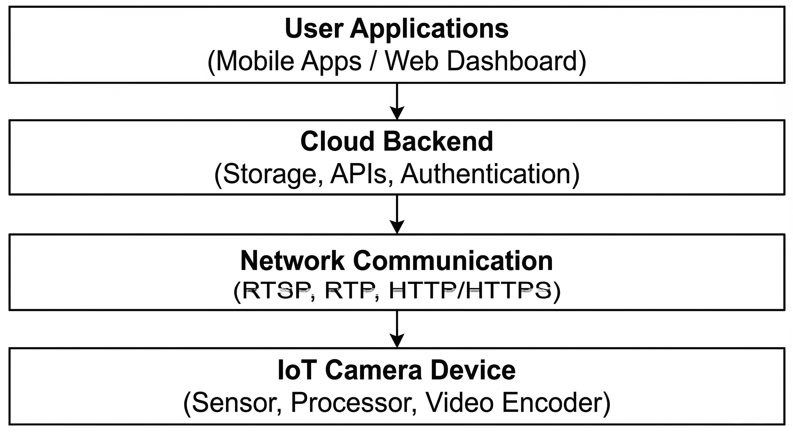

# Threat Modeling and Security Challenges in Cloud-Connected IoT Camera Systems

## 1. Introduction

## 2. Architecture of Cloud-Connected IoT Camera Systems

Cloud connected IoT camera systems are the internet connected cameras that streams , stores and processes video/images via cloud infrastructure. There are four layers of functionality : the physical camera device , the local network , the cloud backend services; and finally the user interface (mobile app or web based).

Each layer works together to provide remote monitoring and video management capabilities. The camera captures an image and sends it via the local network and internet to the cloud service where it is stored, processed or analyzed before being delivered to the end user via their mobile or web application

Understanding how all layers of a cloud connected IoT camera work together is important because each layer has some unique vulnerabilities, and a breach in any one layer could ultimately lead to a breach of the entire system.

### 2.1 IoT Camera Device

The primary hardware component of the cloud-connected camera system is the IoT camera device; it can be thought of as an "all in one" sensing and computing unit, and its purpose is to capture and process the visual data. An example of an IP camera has several different hardware elements including the optical lenses, image sensor, image processing unit, compression module, CPU and memory modules. The lenses and optical filters focus the incoming light on the image sensor, where the visual data is translated into digital signal form. Smart surveillance cameras will often have additional sensor components that include passive infrared (PIR) sensors in addition to the image sensor to provide motion detection and event triggering of the recording function.

Following the capture of the visual data, the camera's image processor will perform pixel processing to prepare the video stream for transmission. The data is next processed through video compression using video compression standards (H.264 or H.265) to minimize bandwidth usage and storage costs. All of these processes are controlled by an embedded CPU and memory system that consists of DRAM for runtime processing and flash memory for holding firmware and configuration data. Most modern IP cameras use custom embedded Linux operating systems to manage the operation of the device, network connections, and interaction with external services.

### 2.2 Network Communication and Streaming

Once a video stream has been captured and compressed in the camera's internal hardware, it will then need to be sent over networks to remote services or users' devices. The majority of IoT cameras are connected to networked devices via Ethernet cable for wired connections, or Wi-Fi routers for wireless connectivity. However, some resource-restricted devices use lower power protocols such as Zigbee, Z-wave, or BLE for their connection to the Internet. When this is the case, the IoT device will send its video to the internet/cloud service via an intermediary IoT gateway/hub.

After the device establishes network connectivity, specialized communication and streaming protocols are used to deliver the video data to remote systems in real time. Video streaming in IoT camera systems is based on various streaming protocols and communication protocols that are focused on delivering media content in real-time.  The real-time streaming protocol (RTSP) typically operating, over TCP port 554 is used mainly to control the multimedia sessions by the clients; but mainly to send commands to the server such as play, pause or stop the stream.  When the connection has been established the real-time transport protocol (RTP) is responsible for transmitting the media packets,  usually over UDP to keep the end-to-end to minimize the delay. 

An additional layer of security can be provided by encrypting the media stream using Secure Real-time Transport Protocol (SRTP) between the server and the client. For other types of communication, web protocols such as HTTP or HTTPS are commonly used between the camera, cloud services, and client devices. Adaptive streaming techniques such as MPEG-DASH may also be used for delivering video content. Alternatively, WebRTC can be implemented to enable low-latency peer-to-peer streaming of camera data to the end user.

### 2.3 Cloud Backend Infrastructure

Cloud backend services are a core element of many IoT camera platforms today, offering a scalable infrastructure to handle device provisioning, video storage, and remote access control. During initial setup, a camera will connect to the cloud service and authenticate by transmitting personal identification data (i.e. device identifier, MAC address). The cloud can then add the device to a user‘s profile enabling remote login. 

Apart from managing identity, cloud platforms also use their infrastructure to store large amount of video streams. The data (live recording or clips based on event) could be uploaded and stored in cloud server. The cloud servers then deliver the video recordings to the authorized users via remote applications and no local storage is required. The users could access the video recordings from anywhere on internet.

 Communication with the cloud service is usually achieved using web APIs. Mobile or web applications will make use of such APIs to setup devices, request live video streams, send commands, for example to tilt or pan, a camera. This is usually achieved via web protocols such as HTTP or HTTPS. 

Another function handled on the cloud infrastructure is the event processing and automation. For instance, cameras could send the event (motion detected) to the cloud service, so it could take measures, such as sending notifications to users, archiving the video, etc. These features make the IoT camera systems to be smart monitoring and remotely manageable.

### 2.4 User Applications

Users interact with an IoT camera system generally through companion mobile apps or web interfaces, which become the hub where a user can configure the camera, watch streams, and remote-control the devices. While installing a camera, the app discovers the device over local network and uploads the network settings to the camera so that it can access the internet and cloud service. After that the camera registers in the cloud platform and tie up to user account.

After successful authentication, users can access camera features through the application interface. The application allows users to request live or recorded video feeds, which are delivered either through the cloud server or directly from the camera when both devices are connected to the same local network. In addition to viewing video streams, users can send control commands such as adjusting camera settings or operating pan–tilt–zoom (PTZ) functions. IoT camera applications also support event-based notifications, where alerts such as motion detection are sent to the user’s device through the cloud platform. These applications therefore serve as the primary interface through which users monitor and manage IoT camera systems.

### 2.5 Data Flow

In a cloud-connected IoT camera system, the data stream flow while a camera device is connected to the internet is between the camera device, the network, and the cloud application. When the image data is captured by a camera sensor, the camera itself does some processing and compresses the video stream based on H.264 or H.265 encoding.

Once the video stream is ready, the camera transmits the information via LAN using a wired Ethernet or a wireless Wi-Fi connection. The device then transmits information to the cloud services over the internet using end-to-end network streaming protocols like RTSP and RTP.

When the video stream reaches the cloud backend, it may be saved, further processed, or forwarded depending on the system. The cloud platform offers services such as authentication of the device, storage of the recorded video, or communication between the camera and the app user. During the time the user activates the camera, it starts streaming the real-time (live view) or a playback (recorded view) to the cloud service. The request is sent to the cloud, which retrieves the stream from the camera or from saved data.

Depending on whether the user device and the camera are on the same local network, the system may sometimes connect them directly rather than streaming through the cloud. This makes the streaming more efficient by reducing latency and improving streaming quality. This flow of data allows, in general, remote streaming, viewing, monitoring, and control of IoT camera systems.

Figure 1: Architecture of a Cloud-Connected IoT Camera System

## 3. Threat Modeling Approach

## 4. Security Challenges

### 4.1 Device Layer Attacks

### 4.2 Network / Streaming Layer Attacks

### 4.3 Cloud / Backend Attacks

### 4.4 Application Layer Attacks

## 5. Cross-Layer Attack Scenarios

## 6. Defense Mechanisms

## 7. Research Gaps

## 8. Conclusion

## References